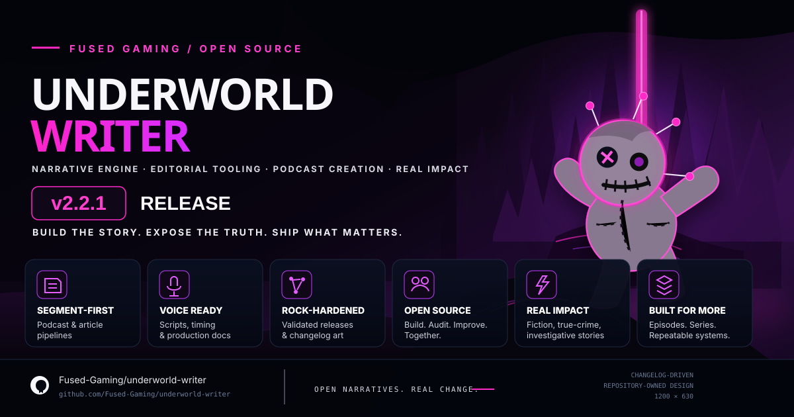

# Underworld Writer



> **Release artwork:** Rock-Hardened supplies changelog/release evidence; Underworld Writer owns the visual design contract in `assets/branding/release-brand.json`. The immutable visual template is `assets/branding/underworld-writer-release-changelog-template.svg`, imported byte-for-byte from ArtPatch. `npm run release:art` regenerates only the declared changelog-driven text zones; `npm run release:art:check` verifies the committed artwork is current.

**Current branch version: 2.2.1**  
Multi-purpose character development, fact-sourced true-crime editorial tooling, and segment-first podcast/article production.

[](package.json)
[](LICENSE)
[](package.json)
[](package.json)

## What Underworld Writer does

Underworld Writer supports three primary workflows:

1. **Creative fiction** — three-phase character and narrative-world development.
2. **True-crime / investigative editorial work** — evidence-aware narrative construction with source attribution and PACER-informed verification workflows.
3. **Podcast + article production** — deterministic, segment-first editorial packages that can produce long-form scripts, articles, producer materials, and downstream audio inputs from a shared evidence package.

## v2.2.x highlights

The 2.2.x line moves Underworld Writer from a collection of generation utilities into a structured editorial workspace that can be used consistently by humans and agents such as Claude, ChatGPT, Codex, Cursor, Copilot, and MCP-based automation.

### Canonical output workspace

Generated and producer-facing artifacts now have one canonical root:

```text
output/
├── SERIES_REGISTRY.json
├── examples/
└── <series-slug>/
    ├── SERIES_CONFIG.json
    ├── production/
    └── season-<n>/
        ├── SEASON_CONFIG.json
        └── episode-<n>/
            ├── EPISODE_CONFIG.json
            ├── planning/
            ├── scripts/
            ├── producer-briefs/
            ├── published-assets/
            ├── verification/
            └── provenance/
```

Repository boundaries are explicit:

```text
projects/   source material, research, evidence, and editorial package specifications
output/     generated editorial and production artifacts
src/        runtime and library implementation
scripts/    generators, validation, release tooling, and workspace automation
```

Legacy/demo output belongs under `output/examples/` instead of competing root-level output directories.

### Cross-agent workspace contract

The repository carries both human-readable and machine-readable rules so future agents do not invent new directory conventions.

- `AGENTS.md` — authoritative repository contract
- `CLAUDE.md` — Claude entry point referencing the shared contract
- `.github/copilot-instructions.md` — Copilot entry point
- `output/SERIES_REGISTRY.json` — registered podcast series
- `schemas/podcast/` — registry, series, season, and episode schemas
- `scripts/validate-output-structure.mjs` — workspace validator
- `validation-tests/workspace-contract.test.mjs` — fixture-based positive/negative validation

Run preflight before agent-driven editorial work:

```bash
npm run agent:preflight
```

### Series / season / episode scaffolding

Agents should scaffold canonical workspaces instead of manually creating directories.

```bash
npm run podcast:new-series -- my-series "My Series"
npm run podcast:new-season -- my-series 1
npm run podcast:new-episode -- my-series 1 1
npm run validate:workspace
```

Generated manifests carry generator/version metadata so workspaces can be traced back to the contract that produced them.

## Segment-first editorial packages

Long-form podcast and article output is now built from composable editorial blocks instead of treating one giant Markdown file as the source of truth.

```text
projects/<series>/episode-packages/season-<n>/episode-<n>.json
                         │
                         ▼
               editorial package engine
                    /           \
                   /             \
        podcast segments       article segments
              │                      │
              ▼                      ▼
      scripts/segments/      published-assets/articles/
              │                      │
              └──── assembled derivative views ────┘
```

The episode package is authoritative. Assembled scripts/articles are derived producer-facing views.

Generate an editorial package:

```bash
npm run editorial:generate -- --series insight-corruption --season 1 --episode 1
```

Validate without writing output:

```bash
npm run editorial:check -- --series insight-corruption --season 1 --episode 1
```

### Reusable blocks

`templates/editorial/shared-segments.json` provides reusable blocks for recurring production material such as:

- series intros
- evidence/source disclosures
- transitions
- sponsor / house-ad slots
- outros
- calls to action
- article deks and source notes

Case-specific evidence remains in the episode package while repeatable editorial structure can be shared across episodes and seasons.

## Insight Corruption reference implementation

Insight Corruption is the first full series using the v2.2.x workspace and editorial-package model.

Canonical locations:

```text
projects/insight-corruption/                         # source/research/configuration
projects/insight-corruption/episode-packages/        # editorial source packages
projects/insight-corruption/production/voice/        # reusable audio-generation specification
output/insight-corruption/                           # generated series output
output/insight-corruption/season-1/episode-1/        # generated Episode 1 package
```

### Episode 1 validation baseline

The Episode 1 reference package currently validates at:

- **13 podcast segments**
- **4,092 scripted words**
- **29.52 estimated minutes** at 145 WPM, including the fixed 90-second mid-roll
- **Runtime validation: PASS** against a 30 ± 1 minute target
- **1,864-word LinkedIn article**
- **Article validation: PASS** against the configured 1,800–2,300 word target

The podcast and LinkedIn article reuse the same vetted evidence/claim package rather than independently rewriting the case facts.

## Authorized voice-production architecture

The reusable synthetic-voice production specification lives at:

```text
projects/insight-corruption/production/voice/VOICE_PODCAST_GENERATION.md
```

It documents the intended Modal-based production architecture, authorized reference-voice handling, segment-level synthesis/retries, ASR critical-token verification, mastering, provenance, benchmarking, and cost controls.

The specification is project-level infrastructure and is not tied to a single episode.

## Quick start

### Install

```bash
npm install @h4shed/skill-underworld-writer
```

### Development

```bash
npm install
npm run build
npm test
```

### Character workflows

```bash
underworld-writer create --name "Hades" --role "Lord" --faction "Olympian"
underworld-writer export --file character.json --output character.md
underworld-writer validate-script --character character.json
```

The original character-development, true-crime adaptation, PACER verification, MCP tooling, Markdown export, and relationship-validation APIs remain supported alongside the newer editorial workspace.

## Validation and benchmarks

Workspace validation:

```bash
npm run validate:workspace
npm run test:workspace
```

Episode 1 editorial fixture:

```bash
npm run test:episode1
```

Benchmarks:

```bash
npm run benchmark:workspace
```

The v2.2.0 baseline recorded on Node 22 measured approximately:

| Workspace operation | Baseline |
| --- | ---: |
| Registry lookup | 0.000238 ms/op |
| Canonical path construction | 0.001439 ms/op |
| Config validation | 0.000249 ms/op |

These microbenchmarks are regression indicators, not cross-machine performance guarantees.

## Release validation with Rock-Hardened

Underworld Writer uses [`@h4shed/rock-hardened`](https://www.npmjs.com/package/@h4shed/rock-hardened) for changelog validation and deterministic release evidence.

```bash
npm run version:check
npm run rock:validate
npm run release:art
npm run release:art:check
npm run validate:release
npm run release:evidence
```

`validate:release` combines:

- release-version checks
- canonical workspace validation
- Rock-Hardened changelog validation
- workspace contract fixtures
- Episode 1 runtime/article validation
- TypeScript build
- Jest tests
- workspace benchmarks

Release artwork uses repository-owned branding: Rock-Hardened provides release/changelog data, while `assets/branding/release-brand.json` and the approved ArtPatch SVG control the Underworld Writer composition. Agents must not redraw the approved release design from primitive SVG shapes.

## Versioning

The package follows Semantic Versioning.

- **2.2.0** — canonical workspace, cross-agent contract, scaffolding/validation, segment-first podcast/article packages, Rock-Hardened release evidence, and the Episode 1 long-form reference package.
- **2.2.1** — patch release branch for release-branding/version-alignment follow-up work and refreshed root documentation.

Primary release metadata is tracked through `package.json`, `plugin.json`, `VERSION.json`, source exports, and the changelog. Use the version tooling rather than manually changing only one surface:

```bash
npm run version:check
npm run version:sync
```

## Repository map

```text
AGENTS.md                       agent contract
CHANGELOG.md                    release history / release-art source
VERSION.json                    release ledger and benchmark evidence
assets/branding/                release-brand contract/assets
docs/                           deeper documentation
output/                         canonical generated content
projects/                       source research and editorial packages
schemas/podcast/                workspace schemas
scripts/                        generation/validation/release tooling
src/                            TypeScript package implementation
templates/editorial/            reusable editorial blocks
validation-tests/               workspace contract tests
```

## MCP / agent integration

Underworld Writer remains MCP-compatible and can be registered with agent ecosystems for character development, validation, export, and editorial workflows.

```typescript
import { Orchestrator } from '@h4shed/mcp-core';
import { registerUnderWorldWriterTools } from '@h4shed/skill-underworld-writer/mcp';

const orchestrator = new Orchestrator();
await registerUnderWorldWriterTools(orchestrator);
```

For any agent operating directly in this repository, **read `AGENTS.md` first**.

## Documentation

- [Getting Started](GETTING_STARTED.md)
- [Contributing](CONTRIBUTING.md)
- [Agent Contract](AGENTS.md)
- [Changelog](CHANGELOG.md)
- [Output Contract](output/README.md)
- [Insight Corruption Setup](INSIGHT_CORRUPTION_SETUP.md)
- [Documentation](docs/)

## License

Released into the public domain under **The Unlicense**. See [LICENSE](LICENSE).

## Support

- [Issues](https://github.com/Fused-Gaming/underworld-writer/issues)
- [Discussions](https://github.com/Fused-Gaming/underworld-writer/discussions)

**Built by Fused Gaming.**