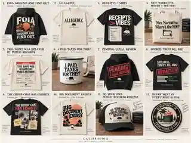

# Califraudia Merch — 12 Concept Reference

Reference storyboard for the Califraudia / Inner Rhythm Media merchandise direction.

## Concepts

1. **FOIA Around and Find Out** — hoodie / public-records meme energy.
2. **Allegedly.** — minimalist premium tee.
3. **Receipts > Vibes** — bold evidence-first graphic tee.
4. **Nice Narrative. Where’s the PDF?** — tote / screenshot-culture humor.
5. **This Shirt Was Delayed by Public Records** — faux official notice tee.
6. **I Paid Taxes for This?** — enamel mug / civic frustration.
7. **Pending Legal Review** — stamped hoodie treatment.
8. **Source: Trust Me, Bro** — redaction / questionable-source tee.
9. **The Group Chat Has Exhibits** — evidence-board graphic tee.
10. **Big Document Energy** — retro California graphic tee.
11. **Do Your Own Public Records Request** — trucker hat / civic-DIY parody.
12. **Department of Everything Is Fine** — faux-agency embroidered patch.

## Direction

Edgy, meme-literate, California-rooted merchandise centered on public records, receipts, accountability, bureaucracy, and independent journalism. Core visual language: warm ivory, washed charcoal/black, muted red, vintage orange, editorial serif typography, California motifs, documentary/evidence graphics, and faux-official treatments.

> Reference only. Rebuild selected concepts as production artwork before manufacturing; do not treat raster mockup lettering or generated details as final print masters.
