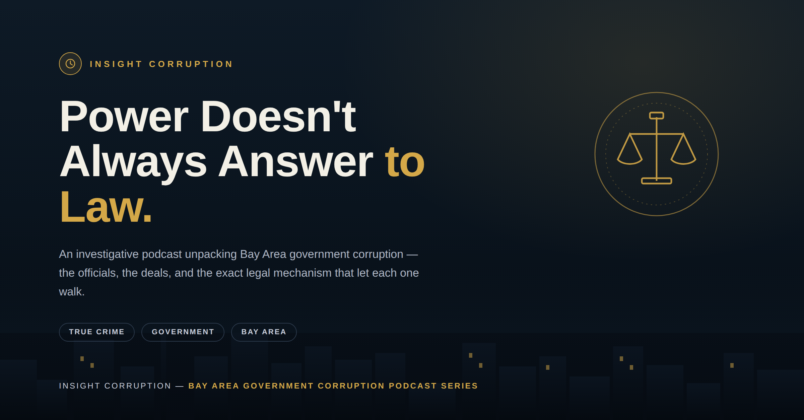

# Episode 5: A $36K Rolex and a Construction Deal

**Subtitle:** Florence Kong's Corruption

| Field | Detail |
| --- | --- |
| Location | San Francisco, California |
| Year | 2023 |
| Offense | Bribed Mohammed Nuru with a $36,000 Rolex watch and luxury gifts in exchange for city contracts |
| Sentence | 1 year + 1 day + $95,000 fine + 3 years probation |
| Escape Mechanism | Luxury bribes treated leniently compared to justice for ordinary citizens |
| Related | Part of a larger contractor corruption scheme |
| Case File | `../../characters/florence-kong-case.json` |

## Investigative Angle

The luxury bribery test: what price buys your way out? This episode tracks how gifts, rather than cash, shaped the leniency of the outcome.

## Status

`ready-for-script-generation`
